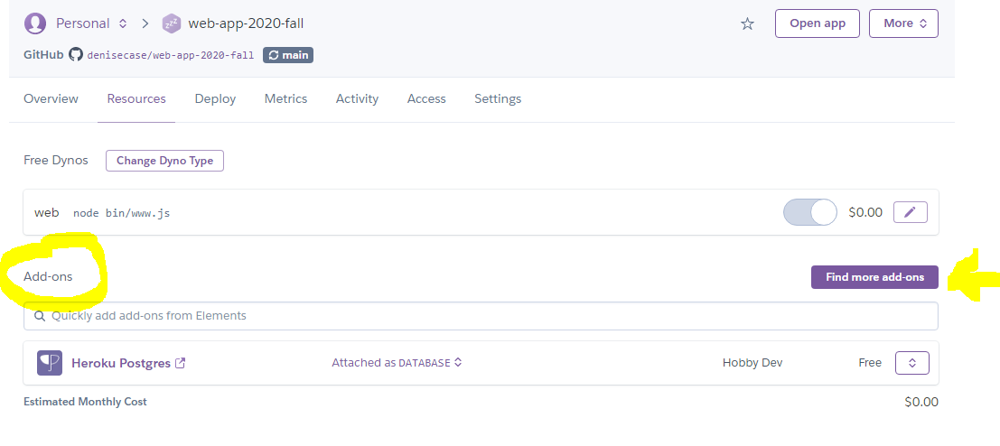
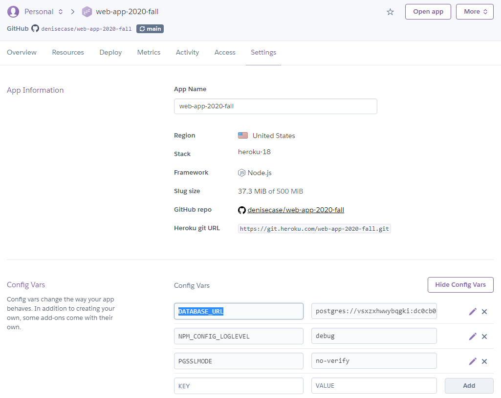

# Production

In Heroku, click New / Create new app.

Name your app.

## Set up automatic deployment

From your Heroku dashboard, click on your app.

Click "Deploy".

Under "deployment method", select GitHub.

Under "automatic deploys", enable automatic deploys from the main branch.

## Add Datastore Add-on

From your Heroku dashboard, click on your app.

Click "Resources".

Click "Find more add-ons".

Add Heroku Postgres (free hobby dev option).



## Verify Datastore

From your Heroku dashboard, click on your app.

Click "Settings".

Click "Reveal Config Vars".

Verify you have a "DATABASE_URL" variable that starts with "postgres://..." as shown below.



## Verify Locally

Install the Heroku CLI (find official documentation).

From your project repo, Open PowerShell as Administrator and run:

```PowerShell
heroku login
```

Verify add-ons:

```PowerShell
heroku addons
```

Verify more (use the name of your app, not the web app one below):

```PowerShell
heroku config --app web-app-2020-fall
heroku pg:info --app web-app-2020-fall
heroku pg:diagnose --app web-app-2020-fall
```

Check your Heroku logs & open your Heroku app in a browser:

```PowerShell
heroku logs --app web-app-2020-fall --tail
heroku open --app web-app-2020-fall
```
